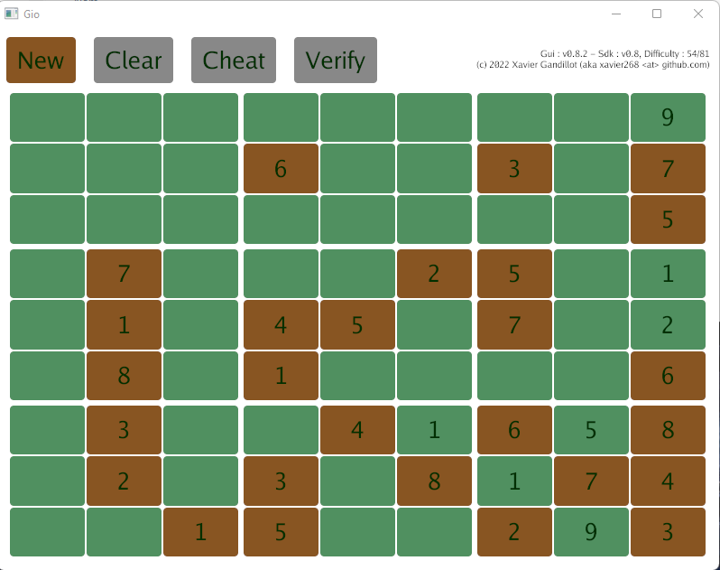

[](https://pkg.go.dev/github.com/xavier268/gudoku)
[](https://goreportcard.com/report/github.com/xavier268/gudoku)

# gudoku
Sudoku builder/solver


# How to launch the GUI version

````

cd gui
go run .

# or, to limit difficulty to 45 blanks
go run . -d 45

````

Click on a green position and the value will increase, Shift-Click and the value will decrease.



# How to use from the command line

```

# to generate 5 puzzles, with solutions, with a low difficulty of 15
cd cli
go run . -s -c=5 -d=15 -o=easy.txt

# to generate 12 puzzle, without solution, with the maximum difficulty, in less than 10 seconds
go run . -c=12 -d=100 -o=difficult.txt -t=10s

# to get help
cd cli
go run . -h

```


# How to use the library directly :

```

import (
	"fmt"
	"math/rand"
	"time"

	"github.com/xavier268/gudoku/sdk"
)

func main() {

	rand := rand.New(rand.NewSource(time.Now().UnixMicro()))
	puzzle, solution := sdk.BuildRandom(rand, 0)

	puzzle.Dump("Puzzle :")
	solution.Dump("Solution :")

	fmt.Println("Shuffling ...")
	s := sdk.NewShuffler(rand)
	s.Shuffle(puzzle, solution)

	puzzle.Dump("Puzzle shuffled:")
	solution.Dump("Solution shuffled :")

}


```
